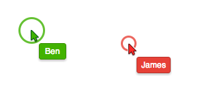

[](https://travis-ci.org/goinstant/click-indicator)

## [Click Indicator Widget](https://developers.goinstant.com/v1/widgets/click_indicator.html)

The [GoInstant](https://goinstant.com) Click Indicator [widget](https://developers.goinstant.com/v1/widgets/index.html)
provides real-time click animations for your application. This allows the local
user to see where remote users click on the page.



[Sign up](https://goinstant.com/signup) and build a GoInstant application today.
You can learn more in our [guides](https://developers.goinstant.com/v1/widgets/guides/index.html),
and [documentation](https://developers.goinstant.com/v1/widgets/click_indicator.html).

Have questions? Contact us using [this form](https://goinstant.com/contact) or
chat with us on IRC. #goinstant on [Freenode](http://freenode.net/).

## Packaging
For your convenience, we've packaged the Click Indicator widget in several
ways.

#### Using our CDN

We host a copy on our CDN. Have a look at the [docs](https://developers.goinstant.com/v1/widgets/click_indicator.html)
to see how to reference those files, as well as how to initialize the component.

#### How do I build the script myself?

You may have your own build process. We've tried to make it easy to include
the Click Indicator widget in your build process.

#### Bower

We've packaged the Click Indicator widget as a [bower](http://bower.io/)
component.

```
bower install goinstant-click-indicator
```

#### Component

We've packaged the Click Indicator widget as a [component](http://component.io/).

```
component install goinstant/click-indicator
```

## Contributing

### Development Dependencies

- [node.js](http://nodejs.org/) >= 0.8.0
- [grunt-cli installed globally](http://gruntjs.com/getting-started)
  - `npm install -g grunt-cli`

### Set-Up

The following assumes that you have already installed the dependencies above.

```
git clone https://github.com/goinstant/click-indicator.git
cd click-indicator
npm install
```

#### Building Click Indicator for Development

The Click Indicator widget is built as a [component](https://github.com/component/component).
Feel free to manually install dependencies and build using the `component`
command line tool.

For convenience, we've included a simple grunt command for installing
component dependencies and building:

```
grunt build
```

If this command runs succesfully you'll now have `components` and `build`
directories in your Git repo root.

### Running Tests

Tests are written in [mocha](http://visionmedia.github.io/mocha/). They're run
in an [HTML file](http://visionmedia.github.io/mocha/#html-reporter).

Just open the test/index.html file to run the tests.

On Mac OS, you can just run this command to open the HTML Runner in your
default browser:

```
open test/index.html
```

## Widgets are built on top of GoInstant

[GoInstant](https://goinstant.com) is an API for integrating realtime,
multi-user functionality into your app. You can check it out and [sign up for free](https://goinstant.com/signup).

## License

&copy; 2013 GoInstant Inc., a salesforce.com company

Licensed under the BSD 3-clause license.
