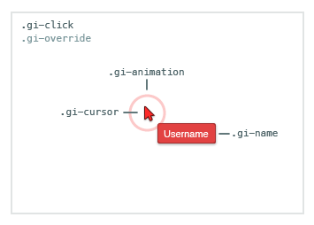

# Click Indicator

[Github Link](html/click_indicator_github.html "include")

The Click Indicator widget provides real-time click animations for your
application. This allows the local user to see where remote users click on the
page.

[Click](html/clicking_demo_iframe.html "include")

The display name and color are properties on the [User's object](../javascript_api/users.html#user-object).
## Table of Contents

1. [Code Example](#code-example)
1. [HTML](#html)
1. [CSS](#css)
1. [Constructor](#constructor)
1. [ClickIndicator#initialize](#clickindicator#initialize)
1. [ClickIndicator#destroy](#clickindicator#destroy)
1. [ClickIndicator#on](#clickindicator#on)
1. [ClickIndicator#off](#clickindicator#off)

## Code Example

### 1. Include our CDN assets:

#### Note on Versioning

Specific version of widgets can be found on our [CDN](https://cdn.goinstant.net/).

```html
<script type="text/javascript" src="https://cdn.goinstant.net/v1/platform.min.js"></script>
<script type="text/javascript" src="https://cdn.goinstant.net/widgets/click-indicator/latest/click-indicator.min.js"></script>
<!-- CSS is optional -->
<link rel="stylesheet" href="https://cdn.goinstant.net/widgets/click-indicator/latest/click-indicator.css" />
```

### 2. Create and initialize the widget

```js
// Connect URL
var url = 'https://goinstant.net/YOURACCOUNT/YOURAPP';

// Connect to GoInstant
goinstant.connect(url, function(err, platformObj, roomObj) {
  if (err) {
    throw err;
  }

  // Create a new instance of the Click Indicator widget
  var clickIndicator = new goinstant.widgets.ClickIndicator({ room: roomObj });

  // Initialize the Click Indicator widget
  clickIndicator.initialize(function(err) {
    if (err) {
      throw err;
    }
    // Click Indicator widget ready to use
  });
});
```

## HTML

### Click Indicator Container

The click indicators are rendered to a `div` that is appended to page body upon
initialization.

```html
<div class="gi-override gi-click-container">
  <!--  Your click indicators go here -->
</div>
```

### Click Indicator Element

Each Click Indicator widget is appended to the click indicator container.

```html
<div class="gi-click">
  <div class="gi-cursor">
    <!-- Cursor image background -->
  </div>
  <div class="gi-animation">
    <!-- Click animation image background-->
  </div>
  <div class="gi-name">
    <!-- User's display name -->
  </div>
</div>
```

## CSS

### Customizing the default CSS

Each class is prefixed with `gi` to avoid conflicts.  The top-level container
also has a `.gi-override` class. Our goal is to make each widget as easy as
possible to customize.

If you have not included our CSS file, you do not need to use the `gi-override`
class when styling the widget.



This stylesheet provides a good starting point for customizing the indicator:

```css
.gi-override .gi-click {
  /* Base click-indicator style customizations */
}

.gi-override .gi-click .gi-name {
  /* Change the name plate styles */
}
```

## Constructor

Creates a new instance of the `Click Indicator` widget using the options
provided.

### Methods

- ###### **new ClickIndicator(optionsObject)**

### Parameters
| optionsObject |
|:---|
| Type: [Object](https://developer.mozilla.org/en-US/docs/Web/JavaScript/Reference/Global_Objects/Object) |
| An object with the following options: |
| - `room` is a required [Room](../javascript_api/rooms/index.html). |
| - `namePlates` [**default: true**] is a [boolean](https://developer.mozilla.org/en-US/docs/Web/JavaScript/Reference/Global_Objects/Boolean) which determines if the display name plates should be shown. |
| - `element` [**default: document.body**] is an [HTMLElement](https://developer.mozilla.org/en-US/docs/Web/API/HTMLElement) to bind the Click Indicator widget to. The click indicators will only be shown in the passed element and its children. |
| - `displayTimer` [**default: 500**] is an integer which dictates the duration a Click Indicator widget is displayed. |
| - `namespace` [**default: ''**] is a string that dictates the namespace of the channel on which to broadcast click events. This allows for multiple instances of the widget to run in the same room, without affecting one another.

### Example

```js
// Join a room
var exampleRoom = platform.room('exampleRoom');
exampleRoom.join(function(err) {
  // Create a new instance of the Click Indicator widget
  var myDiv = document.querySelector('#myDiv');

  var clickIndicator = new ClickIndicator({
    room: exampleRoom,
    namePlates: false,
    element: myDiv,
    displayTimer: 500,
    namespace: 'my-new-channel'
  });
});
```

## ClickIndicator#initialize

Start showing my clicks on remote users' screens and remote users' clicks on my screen.

### Methods

- ###### **clickIndicator.initialize(callback(errorObject))**

### Parameters

| callback(errorObject) |
|:---|
| Type: [Function](https://developer.mozilla.org/en-US/docs/Web/JavaScript/Reference/Global_Objects/Function) |
| Called if an issue was encountered attempting to subscribe to the room. |
| - `errorObject` will be `null` unless an error has occured. |

### Example

```js
// Initialize the Click Indicator widget
clickIndicator.initialize(function(err) {
  if (err) {
    throw err;
  }

  // Click Indicator widget ready to use
});
```

## ClickIndicator#destroy

Stop showing my clicks on remote users' screens and remote users' clicks on my screen.

### Methods

- ###### **clickIndicator.destroy(callback(errorObject))**

### Parameters

| callback(errorObject) |
|:---|
| Type: [Function](https://developer.mozilla.org/en-US/docs/Web/JavaScript/Reference/Global_Objects/Function) |
| Called if an issue was encountered attempting to unsubscribe from rooms associated with this instance. |
| - `errorObject` will be `null` unless an error has occured. |

### Example

```js
// Initialize the Click Indicator widget
clickIndicator.initialize(function(err) {
  if (err) {
    throw err;
  }

  // Click Indicator widget ready to use

  // Destroy the Click Indicator widget
  clickIndicator.destroy(function(err) {
    if (err) {
      throw err;
    }

    // Click Indicator widget destroyed
  });
});
```

## ClickIndicator#on

Listen for local or remote click events including the element
clicked in, the location of the click in that element, and the user object that
performed the click.

### Supported Events

- error: Emitted if an error is received from the GoInstant server.
- localClick: Emitted when the local user clicks, taps, or selects.
- remoteClick: Emitted when a remote user clicks, taps, or selects.

### Methods

- ###### **clickIndicator.on(event, listener(clickData))**

### Parameters

| eventName |
|:---|
| Type: [String](https://developer.mozilla.org/en-US/docs/Web/JavaScript/Reference/Global_Objects/String) |
| The name of the event to add a listener for. |

| listener |
|:---|
| Type: [Function](https://developer.mozilla.org/en-US/docs/Web/JavaScript/Reference/Global_Objects/Function) |
| The listener to add. |
| - `clickData` A clickdata object. |

| clickData |
|:---|
| Type: [Object](https://developer.mozilla.org/en-US/docs/Web/JavaScript/Reference/Global_Objects/Object) |
| An object describing the click. |
| - `userObject` A GoInstant [User Object](../javascript_api/users.html#user-object) |
| - `element` is the [HTMLElement](https://developer.mozilla.org/en-US/docs/Web/API/HTMLElement) clicked in. |
| - `offsetX` is the horizontal click position in the element represented as an offset of pixels from the left. |
| - `offsetY` is the vertical click position in the element represented as an offset of pixels from the top. |

### Example

```js
function listener(clickData) {
  // Do something with clickData

}

// Register listener
clickIndicator.on('localClick', listener);
clickIndicator.on('remoteClick', listener);
```

## ClickIndicator#off

Stop listening for local or remote click events.

### Methods


- ###### **clickIndicator.off()**
- ###### **clickIndicator.off(eventName, listener(clickData))**

### Parameters

| eventName |
|:---|
| Type: [String](https://developer.mozilla.org/en-US/docs/Web/JavaScript/Reference/Global_Objects/String) |
| The name of the event to add a listener for. |

| listener |
|:---|
| Type: [Function](https://developer.mozilla.org/en-US/docs/Web/JavaScript/Reference/Global_Objects/Function) |
| The listener to add. |
| - `clickData` A clickData object. |

### Example

```js
function listener(clickData) {
  // Do something with clickData

}

// Register listener
clickIndicator.on('localClick', listener);
clickIndicator.on('remoteClick', listener);

// Deregister listener
clickIndicator.off('localClick', listener);
clickIndicator.off('remoteClick', listener);
```
